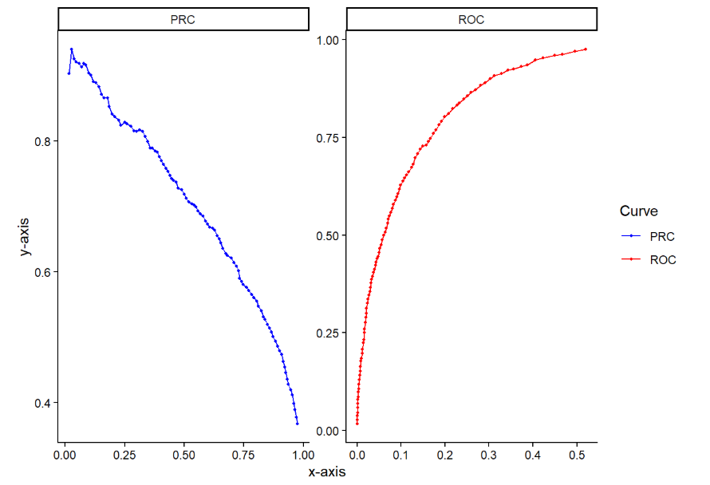

# m6APrediction: A Random Forest-Based Tool for Predicting m6A RNA Methylation Sites

## 🧬 Overview

**m6APrediction** is an R package developed to identify **N6-methyladenosine (m6A)** RNA methylation sites from sequence-derived features using a **Random Forest (RF)** classifier.  
It provides two core functions — **`prediction_multiple()`** and **`prediction_single()`** — enabling both high-throughput and single-site predictions.

m6A is one of the most abundant internal RNA modifications in eukaryotes. It plays a crucial role in **gene expression regulation**, **RNA stability**, and **translation efficiency**.  
By integrating machine learning with sequence-derived features, *m6APrediction* offers an efficient computational tool to explore m6A methylation patterns and their potential regulatory mechanisms.

---

## ⚙️ Installation

To install **m6APrediction** directly from GitHub, ensure you have the `devtools` or `remotes` package installed:

```r
# Option 1: Using devtools
install.packages("devtools")
devtools::install_github("yourname/m6APrediction")

# Option 2: Using remotes
install.packages("remotes")
remotes::install_github("yourname/m6APrediction")

# Load example model and data
model <- readRDS(system.file("extdata", "rf_fit.rds", package = "m6APrediction"))
example_input <- read.csv(system.file("extdata", "m6A_input_example.csv", package = "m6APrediction"))


## 📦 Example Usage
# --- 1️⃣ Batch prediction ---
results <- prediction_multiple(model, example_input)
head(results)

# --- 2️⃣ Single sequence prediction ---
single_result <- prediction_single(
  ml_fit = model,
  gc_content = 0.45,
  RNA_type = "mRNA",
  RNA_region = "3'UTR",
  exon_length = 10,
  distance_to_junction = 8,
  evolutionary_conservation = 0.6,
  DNA_5mer = "GGACA"
)
print(single_result)



